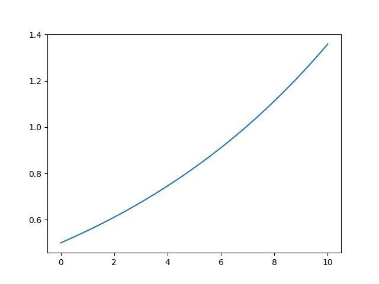

# Prerequisites

The examples in this section will require using some Python libraries. All we need can be loaded by running:

~~~
import numpy as np
import matplotlib.pyplot as plt
~~~
{: .language-python}

Python's package `scipy` has a powerful differential equation solver called `odeint`. We can load it by running:

~~~
from scipy.integrate import odeint
~~~
{: .language-python}

> ## A few lines about `odeint`
>
>
>`odeint` can easily solve initial value problems ordinary differential equations and systems or ordinary differential equations. The basic elements of such a problem are the following:
>
> - The dynamics $\frac{dy}{dt}$, as a function of the state itself and of time ($y$, $t$).
> - The initial sate ($y_0$).
> - The vector of times to simulate ($ts$).
{: .callout}

# Population growth

## Malthusian growth
In 1798, Thomas Malthus published _An essay on the principle of population_. It contained one of the earliest (and also poorest) population growth models. In modern mathematical language, Malthus' model will read as: _the growth rate of a population is proportional to its size_. This can be easily translated to the differential equation:

$$
\frac{dy}{dt} = r \cdot y
$$

where $y$ represents the population and $r$ the proportionality coefficient.

### Do it in Python

The following code chunk defines the basic elements needed to solve the initial value problem for $r = 0.1$:

~~~
# Set initial value problem
## Dynamics
def dydt(y, t):
    return 0.1*y

## Initial value
y0 = 0.5

## Set times to solve for
ts = np.linspace(0, 10, 100)
~~~
{: .language-python}

Now we are ready to use `odeint`:
~~~
# Integrate numerically
ys = odeint(dydt, y0, ts)
~~~
{: .language-python}

The previous chunk generates a vector _ys_, whose values correspond to the states at the times given by the vector _ts_. It is always nice to visualize our solution:
~~~
# Plot solution
plt.plot(ts, ys)
plt.show()
~~~
{: .language-python}

> ## Question
>
> In a previous code chunk we defined the dynamics as a function of state (y) and time (t). Actually, the time is not being used in the body of the function. I am talking about this chunk:
> ~~~
> def dydt(y, t):
>    return 0.1*y
> ~~~
> {: .language-python}
>
> Why do we need the time then?
>
>
> > ## Solution
> >
> > `odeint` **always** expects a function of state and time as an input.
> >
> {: .solution}
{: .challenge}

## Logistic growth
FIXME


